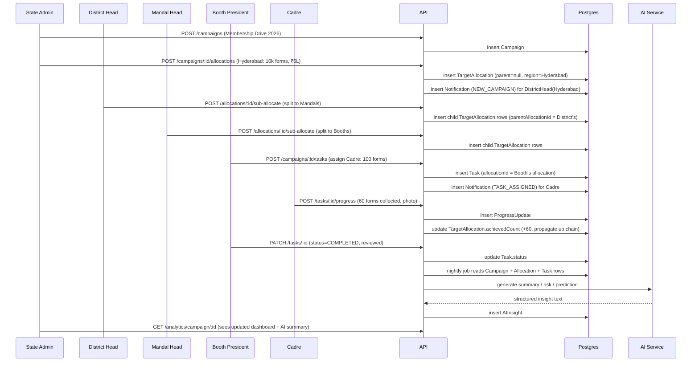

# PoliOS — Campaign Management Module

Internal-only module for party leadership and cadres (no citizen-facing surface).
Schema: `prisma/schema.prisma`.

## 1. Hierarchy → System Roles

| Org Role | HierarchyLevel enum | Typical scope |
|---|---|---|
| State Admin | `STATE_ADMIN` | Full control, creates campaigns, approves state budget |
| State Leaders | `STATE_LEADER` | View/steer all districts, approve large expenses |
| District Head | `DISTRICT_HEAD` | Splits district target → mandals, approves district budget |
| Constituency Head | `CONSTITUENCY_HEAD` | Same tier as mandal-grouping, optional layer |
| Mandal Head | `MANDAL_HEAD` | Splits mandal target → booths |
| Booth President | `BOOTH_PRESIDENT` | Assigns tasks to cadres |
| Cadre | `CADRE` | Executes tasks, submits progress + expenses |

Every `User.parentUserId` mirrors this chain, and every `Region` (STATE→DISTRICT→CONSTITUENCY→MANDAL→BOOTH) is a self-referencing tree. `TargetAllocation.parentAllocationId` then lets a target/budget row be split recursively down that same tree — one generic mechanism handles every level instead of one table per hierarchy level.

## 2. Role Permission Matrix

| Action | State Admin | State Leader | District Head | Mandal Head | Booth President | Cadre |
|---|---|---|---|---|---|---|
| Create campaign | ✅ | ❌ | ❌ | ❌ | ❌ | ❌ |
| Allocate target/budget to child region | ✅ (to districts) | view only | ✅ (to mandals) | ✅ (to booths) | ✅ (to cadres, as tasks) | ❌ |
| Approve budget | ✅ | ✅ | ✅ (own district) | ✅ (own mandal) | ❌ | ❌ |
| Create/assign task | ✅ | ❌ | ✅ | ✅ | ✅ | ❌ |
| Submit progress update | ❌ | ❌ | ❌ | ❌ | ❌ | ✅ |
| Submit expense | ✅ | ✅ | ✅ | ✅ | ✅ | ✅ |
| Approve/reject expense | ✅ | ✅ | ✅ (own scope) | ✅ (own scope) | ❌ | ❌ |
| Send announcement | ✅ (any scope) | ✅ (below) | ✅ (below) | ✅ (below) | ✅ (own booth) | ❌ |
| View reports | ✅ (all) | ✅ (all) | own district | own mandal | own booth | own tasks |
| View AI insights | ✅ (all) | ✅ (all) | own district | own mandal | own booth | ❌ |

Enforced via a NestJS `RolesGuard` + a `RegionScopeGuard` that checks the requested `regionId`/`campaignId` falls under `req.user`'s subtree (walk `Region.parentId` up, or cache the subtree in Redis per user).

## 3. Folder Structure

```
/apps
  /web                          Next.js (App Router)
    /app
      /(auth)/login
      /dashboard                 campaign dashboard (home)
      /campaigns
        /new                     campaign creation wizard
        /[id]
          /targets               target distribution tree
          /budget                budget management
          /tasks                 task board
          /reports               report generation
      /analytics                 cross-campaign analytics
    /components
      /campaign-card, /kpi-tile, /allocation-tree, /task-board, /charts
    /lib                        api client, auth
    /store                      zustand stores (campaign, filters, notifications)

  /api                          NestJS
    /src
      /modules
        /auth                   JWT, login, refresh
        /users                  hierarchy CRUD
        /regions                region tree CRUD
        /campaigns              campaign CRUD + dashboard summary
        /allocations            target/budget distribution + sub-allocate
        /tasks                  task CRUD + progress updates
        /expenses               expense submit/approve
        /communication          announcements
        /notifications          notification fan-out
        /reports                PDF/Excel generation
        /analytics              KPI + chart aggregation queries
        /ai                     LLM wrapper: summary/prediction/risk/recommendation
      /common
        /guards                 RolesGuard, RegionScopeGuard, JwtAuthGuard
        /decorators             @Roles(), @CurrentUser()
        /interceptors           AuditLogInterceptor
      /prisma                   PrismaService

/packages
  /shared-types                 DTOs/enums shared between web and api
  /ui                            shared shadcn/ui component wrappers

/prisma/schema.prisma
```

## 4. REST API

```
Auth
  POST   /auth/login
  POST   /auth/refresh
  GET    /auth/me

Campaigns
  POST   /campaigns
  GET    /campaigns?status=&priority=
  GET    /campaigns/:id
  PATCH  /campaigns/:id
  POST   /campaigns/:id/status              (activate/complete/cancel)
  GET    /campaigns/dashboard-summary        (active/upcoming/completed counts, totals)

Target & Budget Allocation
  POST   /campaigns/:id/allocations          (root allocation, e.g. State -> District)
  GET    /campaigns/:id/allocations/tree     (full hierarchy tree for a campaign)
  POST   /allocations/:id/sub-allocate       (District Head splits into Mandals, etc.)
  PATCH  /allocations/:id
  POST   /allocations/:id/budget/approve
  GET    /allocations/:id/budget-summary

Tasks
  POST   /campaigns/:id/tasks
  GET    /tasks?assignedToId=&status=&campaignId=
  PATCH  /tasks/:id
  POST   /tasks/:id/progress                 (cadre submits update)
  GET    /tasks/:id/progress-history

Expenses
  POST   /expenses
  GET    /expenses?campaignId=&status=
  PATCH  /expenses/:id/approve
  PATCH  /expenses/:id/reject

Communication
  POST   /campaigns/:id/announcements
  GET    /announcements?campaignId=

Notifications
  GET    /notifications
  PATCH  /notifications/:id/read

Reports
  GET    /reports/campaign/:id/summary
  GET    /reports/district/:regionId
  GET    /reports/mandal/:regionId
  GET    /reports/booth/:regionId
  GET    /reports/cadre/:userId
  GET    /reports/budget/:campaignId
  GET    /reports/expense/:campaignId
  GET    /reports/export?type=campaign|budget|expense&format=pdf|excel&id=

Analytics
  GET    /analytics/campaign/:id             (target %, budget %, chart series)
  GET    /analytics/district-progress?campaignId=
  GET    /analytics/mandal-progress?campaignId=
  GET    /analytics/booth-progress?campaignId=
  GET    /analytics/top-performers?campaignId=&level=district|cadre
  GET    /analytics/pending-overdue?campaignId=

AI
  POST   /ai/campaigns/:id/summary
  POST   /ai/campaigns/:id/weekly-report
  GET    /ai/campaigns/:id/risks
  GET    /ai/campaigns/:id/predict-completion
  GET    /ai/campaigns/:id/slow-regions
  POST   /ai/campaigns/:id/recommend-budget-redistribution
  GET    /ai/campaigns/:id/next-actions
```

## 5. Workflow Sequence



## 6. Page Wireframes (ASCII)

### 6.1 Campaign Dashboard (home)

```
┌─────────────────────────────────────────────────────────────────────┐
│  PoliOS   Campaigns ▾   Analytics   Reports        🔔 3   [Avatar]   │
├─────────────────────────────────────────────────────────────────────┤
│  [Active: 4] [Upcoming: 2] [Completed: 11]     Filter: District ▾    │
├───────────────┬───────────────┬───────────────┬─────────────────────┤
│ Total Budget   │ Total Target  │ Overall Progress │ Avg. Completion   │
│ ₹1.2 Cr        │ 1,50,000      │ ▓▓▓▓▓▓░░ 68%     │  22 days left     │
├───────────────┴───────────────┴───────────────┴─────────────────────┤
│  Campaign Cards (grid)                                               │
│  ┌───────────────┐ ┌───────────────┐ ┌───────────────┐               │
│  │ Membership     │ │ Poster Drive  │ │ Rally Prep    │               │
│  │ Drive 2026     │ │               │ │               │               │
│  │ HIGH · ACTIVE  │ │ MED · ACTIVE  │ │ HIGH · UPCOM. │               │
│  │ ▓▓▓▓▓░ 62%     │ │ ▓▓▓░░░ 38%    │ │ — not started │               │
│  │ ₹5L/₹25L used  │ │ ₹1L/₹8L used  │ │ ₹0/₹12L       │               │
│  └───────────────┘ └───────────────┘ └───────────────┘               │
└───────────────────────────────────────────────────────────────────────┘
```

### 6.2 Campaign Creation Wizard

```
Step 1: Basics        Step 2: Target & Budget      Step 3: Docs & Review
┌───────────────────┐ ┌──────────────────────────┐ ┌───────────────────┐
│ Name               │ │ Total Target: [50,000]    │ │ Required Docs:     │
│ Description         │ │ Total Budget: [₹25,00,000]│ │ [+ Add document]   │
│ Objective           │ │ Expected Volunteers: [__] │ │ Attachments: drag/ │
│ Category ▾          │ │                            │ │ drop banner + files│
│ Start [📅] End [📅] │ │                            │ │                     │
│ Priority ▾          │ │                            │ │ [Save Draft]        │
│ Banner: [Upload]    │ │                            │ │ [Create Campaign]   │
└───────────────────┘ └──────────────────────────┘ └───────────────────┘
```

### 6.3 Target Distribution (tree view)

```
Membership Drive 2026 — Target 50,000 / Budget ₹25,00,000
┌─────────────────────────────────────────────────────────────────┐
│ ▾ Hyderabad District        Target 10,000  Budget ₹5,00,000  [Edit] │
│     ▾ Secunderabad Mandal    Target 4,000   Budget ₹2,00,000       │
│         Booth 12   Target 800   Budget ₹40,000   [Assign Cadres]  │
│         Booth 13   Target 800   Budget ₹40,000                    │
│     ▸ Malkajgiri Mandal      Target 6,000   Budget ₹3,00,000       │
│ ▸ Warangal District          Target 8,000   Budget ₹4,00,000       │
│                                                                     │
│ [+ Add District Allocation]        Unallocated: 32,000 / ₹16,00,000│
└─────────────────────────────────────────────────────────────────┘
```
Each row is a `TargetAllocation`; expanding shows `childAllocations`. The "unallocated" figure is `parent.target − sum(children.target)`, computed live.

### 6.4 Task Management (board view)

```
┌─────────────┬─────────────────┬─────────────────┬─────────────┐
│ Pending      │ In Progress      │ Completed        │ Overdue      │
├─────────────┼─────────────────┼─────────────────┼─────────────┤
│ Collect 100  │ Visit 500 houses │ Install 50       │ Conduct 5    │
│ forms        │ — Cadre: Ravi    │ posters          │ meetings     │
│ Cadre: Priya │ 62% ▓▓▓▓░░       │ ✓ 100% Approved  │ Cadre: Kiran │
│ Due in 3d    │                  │                  │ 2 days late  │
└─────────────┴─────────────────┴─────────────────┴─────────────┘
```

### 6.5 Budget Page

```
┌──────────────────────────────────────────────────────────┐
│  Allocated ₹5,00,000  Approved ₹4,50,000  Spent ₹2,10,000  │
│  Remaining ₹2,40,000  Pending Approval ₹50,000              │
├──────────────────────────────────────────────────────────┤
│  Expense Requests                                            │
│  Poster Printing   ₹15,000   [Bill 📎]   PENDING  [✓][✗]     │
│  Travel            ₹8,000    [Bill 📎]   APPROVED             │
│  Food               ₹6,500    [Bill 📎]   REJECTED — reason   │
└──────────────────────────────────────────────────────────┘
```

### 6.6 Reports Page

```
Report Type ▾ [Campaign Summary | District | Mandal | Booth | Cadre | Budget | Expense | Performance]
Filters: Campaign ▾  Region ▾  Date Range 📅
[Generate]   →   Preview table   →   [Export PDF]  [Export Excel]
```

### 6.7 Analytics Dashboard

```
┌───────────────┬───────────────┬───────────────┬───────────────┐
│ Success Rate   │ Target Achv %  │ Budget Util %  │ Overdue Tasks  │
│    82%         │     68%        │     42%        │      14        │
├───────────────┴───────────────┴───────────────┴───────────────┤
│ [Daily] [Weekly] [Monthly]        Progress line/bar chart        │
├──────────────────────────┬──────────────────────────────────────┤
│ District-wise progress    │  Top Performing Districts             │
│ (bar chart)                │  1. Hyderabad  94%                    │
│                             │  2. Warangal   81%                    │
├──────────────────────────┼──────────────────────────────────────┤
│ Mandal / Booth heat table  │  Top Performing Cadres                │
└──────────────────────────┴──────────────────────────────────────┘
```

## 7. AI Integration Points — be precise about what's "AI" vs. what's just a query

A common mistake is routing arithmetic through an LLM. Split cleanly:

| Feature | How it's actually computed | AI's role |
|---|---|---|
| Target achievement %, budget utilization % | Plain SQL aggregation over `TargetAllocation`/`ExpenseRequest` | none |
| Identify slow-performing districts | Rank regions by `achievedCount/target` with SQL `ORDER BY` | AI only writes the narrative on top ("Warangal is 20% behind pace because...") |
| Predict completion date | Simple linear projection from daily progress rate (statistics, not LLM) | AI phrases the prediction + caveats |
| Recommend budget redistribution | Rule: flag allocations with `spentBudget/allocatedBudget` far below/above peers | AI drafts the specific recommendation text and reasoning |
| Highlight risks | Threshold rules (overdue tasks > N, budget pace mismatch, low volunteer turnout) | AI turns the flagged rule violations into a readable risk brief |
| Campaign summary / weekly report | Pull the week's stats via SQL | AI writes the prose summary from that stat bundle (scheduled job → `AIInsight` row) |
| Suggest next actions | n/a (no ground truth to rank) | AI proposes actions given the stat bundle + risk flags — always shown as "AI Suggestion", never auto-applied |

Implementation: one `AiService.generate(promptTemplate, dataBundle)` wrapper around the Claude API. No agent framework, no planner — each of the eight endpoints above calls it with a different prompt template and a JSON data bundle assembled by plain SQL/Prisma queries. This keeps AI output grounded in real numbers instead of letting the model guess at figures.

## 8. Notification Triggers

| Event | Recipients |
|---|---|
| `Campaign` created | all Region heads at the next level down from creator |
| `TargetAllocation` sub-allocated | the new owner (e.g., Mandal Head) |
| `Task` assigned | `assignedToId` (the cadre) |
| Expense approved/rejected | `submittedById` |
| Deadline reminder (cron, T-2 days) | assignee of any `Task`/`TargetAllocation` not yet complete |
| Campaign completed | full chain from creator down |

## 9. Architecture Fit

This module is one set of modules inside the modular monolith discussed earlier (`campaigns`, `allocations`, `tasks`, `expenses`, `communication`, `notifications`, `reports`, `analytics`, `ai`) — it does not need its own microservice, database, or message broker. `TargetAllocation`'s self-referencing tree is what makes "State splits to District splits to Mandal splits to Booth" a single reusable table and API instead of five hardcoded hierarchy tables.
